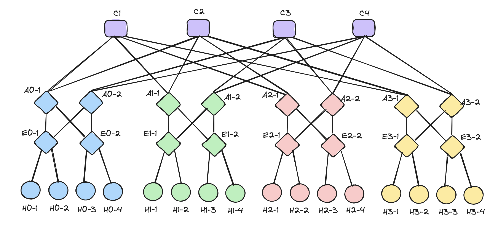

# Mininet Lab

## Description

This Mininet lab shows how to build a network with some topology structures and
build OVS links on it.

## Features

- Lightweigt network environment simulation
- Highly efficient

## Prerequisite

- A virtual environment.
- Mininet: refer to [official documents](https://mininet.org/download/) and get started with Mininet.

## Usage

The fat-tree topology is defined in `a1-net.py` and test cases in `test.tt`.



```bash
> make run # clean cached buffer first and start mininet with given net
           # configuration
```

In the Mininet CLI,

```bash
mininet> source scripts/conf.tt # add OVS link for the net 
```

Run tests with given test file,

```bash
mininet> source scripts/test.tt
```

Log all tests and dump into log directory

```bash
mininet> source scripts/log.tt
```

Finally exit mininet lab environment.

```bash
mininet> exit
```

Here is an example of the output of the execution.

```bash
> make run
cleaning up cached buffer...  done.
starting to configure mininet...

mininet> source scripts/conf.tt
setting up OVS links for the net...  finished.

mininet> source scripts/test.tt
iperf tests start...
*** Iperf: testing TCP bandwidth between h0_1 and h0_3
*** Results: ['11.5 Mbits/sec', '13.9 Mbits/sec']
*** Iperf: testing TCP bandwidth between h0_2 and h0_3
*** Results: ['11.5 Mbits/sec', '13.9 Mbits/sec']
*** Iperf: testing TCP bandwidth between h1_1 and h2_2
*** Results: ['11.4 Mbits/sec', '14.2 Mbits/sec']
*** Iperf: testing TCP bandwidth between h1_2 and h1_3
...
--- 10.0.0.15 ping statistics ---
1 packets transmitted, 1 received, 0% packet loss, time 0ms
rtt min/avg/max/mdev = 18.753/18.753/18.753/0.000 ms
all tests passed.

mininet> source scripts/log.tt
logging starts (this process may take several minutes).

dumpping flows of every switch...  done!
logging iperf tests...  done!
ping tests start...
h0_1 ping -c20 h0_3
h0_2 ping -c20 h0_3
h1_1 ping -c20 h2_2
h1_2 ping -c20 h1_3
h3_1 ping -c20 h3_2
h3_2 ping -c20 h3_3
done!

finished logging.
Please check log directory to see details (logs/).

mininet> exit
```

## Structrue

```bash
.
├── assets
│   └── topo.png
├── fat-tree.py     # network definition
├── flow-rules.sh   # switch rules
├── logs            # logs
├── Makefile
├── README.md
└── scripts         # scripts
    ├── conf.tt
    ├── log.tt
    └── test.tt
```

## License

MIT License

Copyright (c) 2024 nyit.edu

Permission is hereby granted, free of charge, to any person obtaining a copy of this software and associated documentation files (the "Software"), to deal in the Software without restriction, including without limitation the rights to use, copy, modify, merge, publish, distribute, sublicense, and/or sell copies of the Software, and to permit persons to whom the Software is furnished to do so, subject to the following conditions:

The above copyright notice and this permission notice shall be included in all copies or substantial portions of the Software.
